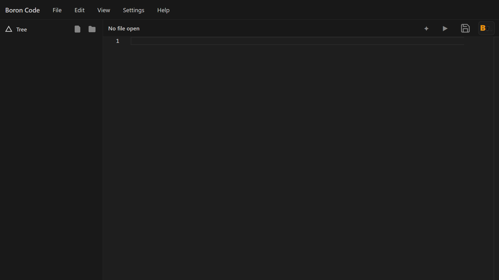
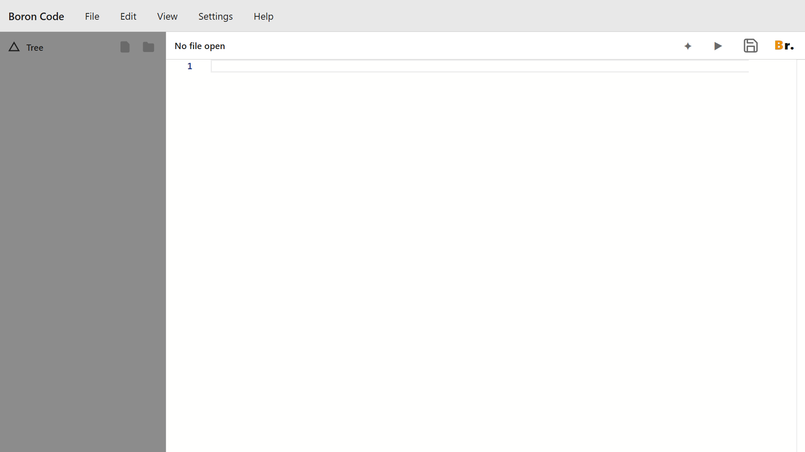
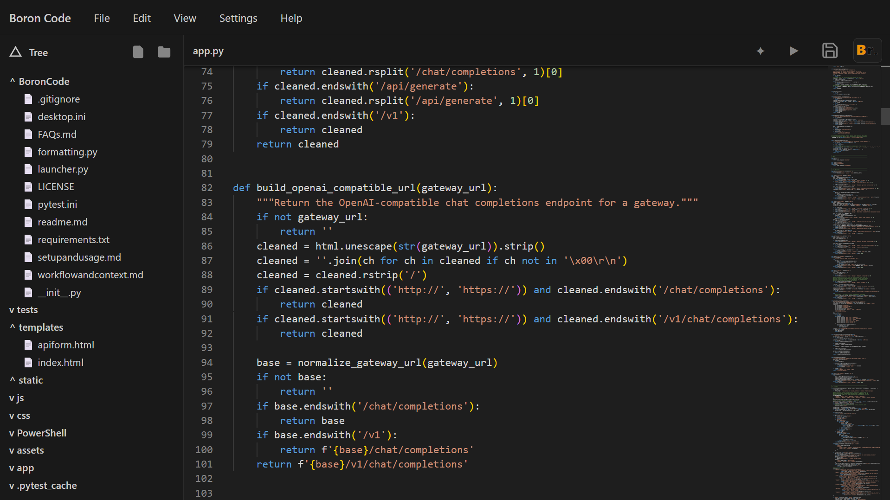
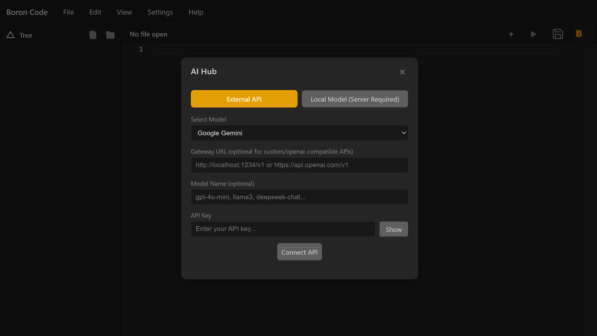
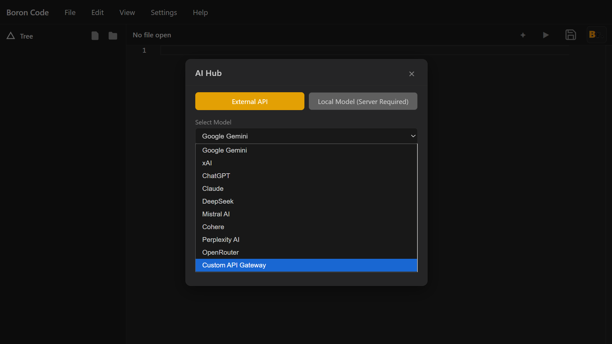

# Boron Code: Workflow and Technical Context

This document is the working source of truth for the Boron Code project. It describes the runtime architecture, operational flow, and the engineering assumptions behind the app rather than a marketing overview.

## Screenshots - Homepage, while in use, and AI Integration

### Homepage - Default

### Homepage - Light Mode

### WhiLe Working - editing code

### AI Integration - Native Support for API as well as Local Models 

### AI - Multi-Provider Support

---

## 1. Project purpose

Boron Code is a lightweight local IDE/workspace environment that combines:
- workspace browsing and file management
- code execution for local scripts
- shell access via the operating system terminal
- AI assistant integration through either cloud providers or custom gateways
- safe path handling for files and model locations

The application is implemented primarily as a Flask backend with a browser-based frontend and optional pywebview shell wrapper.

---

## 2. Runtime structure

### Primary backend
- `app/app.py` contains the Flask server, endpoint handlers, path validation helpers, AI provider adapters, terminal resolution logic, and file execution logic.

### UI layer
- `templates/index.html` and `templates/apiform.html` provide the main workspace and API configuration surfaces.
- `static/js/main.js` handles the interactive editor behavior, workspace tree updates, and UI event wiring.
- `static/css/style.css` defines the IDE-style design tokens and dark/light theme patterns.

### Launch wrapper
- `launcher.py` starts the application in a desktop-style shell using pywebview when a native desktop experience is desired.

### Supporting files
- `formatting.py` is used for formatting logic and code cleanup helpers.
- `requirements.txt` defines the runtime dependencies.
- `tests/` contains regression checks for gateway handling and terminal resolution.

---

## 3. Core execution flow

### Browser / UI request flow
1. The browser loads the main UI from the Flask app.
2. User interactions trigger AJAX requests to endpoints in `app/app.py`.
3. The server validates payloads, resolves workspace paths, and restricts access outside the project root.
4. Results are returned as JSON payloads for the frontend to update the UI.

### File workflow
- `read-file` loads workspace content from disk.
- `save-file` writes sanitized UTF-8 content back to the project file.
- `create-folder` ensures the destination remains inside the workspace root.
- `run-file` executes safe script targets only after validation.

### AI workflow
- `verify-external-api` validates the selected provider and gateway input.
- `ai-chat` routes requests based on provider choice and API presence.
- `call_external_ai_api()` handles provider normalization and HTTP requests.
- `call_local_ai_model()` attempts to contact common local gateways such as localhost ports used by Ollama or similar services.

---

## 4. Security model

The backend is intentionally defensive.

### Path restrictions
- `resolve_workspace_path()` prevents traversal outside the workspace root.
- `is_git_restricted()` blocks any path that touches `.git` directories.
- `is_safe_relative_path()` rejects suspicious shell metacharacters and unsafe file names.

### Input sanitization
- `sanitize_str()` strips control characters and escapes user-controlled strings before display.
- Provider names are constrained to a safe allowlist and normalized before outbound API calls.
- Gateway URLs are normalized to avoid mismatches from trailing slashes or common path patterns.

### Execution restrictions
- `run-file` accepts only a small set of file extensions and executes via `subprocess.run(..., shell=False)`.
- No shell interpretation is used with user file paths.

---

## 5. Gateway and provider normalization

Custom gateway support is implemented in a way that handles common endpoint variants.

### URL normalization rules
- Missing scheme is auto-filled with `http://`.
- Trailing slashes are stripped.
- `/chat/completions`, `/api/generate`, and `/v1` suffixes are normalized to a base gateway root.
- The final OpenAI-compatible endpoint is constructed as `/v1/chat/completions` when needed.

This lets requests work across gateway shapes such as:
- `localhost:1234/v1/`
- `https://example.com/base/`
- `https://api.example.com/chat/completions`

### Provider routing logic
- Custom and gateway provider labels are treated as a single route category.
- Non-custom providers still require a valid API key.
- The external API adapter supports OpenAI-compatible and vendor-specific payload formats, including Gemini and Anthropic style endpoints.

---

## 6. Terminal resolution strategy

Terminal selection is intentionally layered and deterministic.

### Resolution order
1. `bash` from `PATH`
2. Common Git for Windows install paths, including `Git\bin\bash.exe`
3. Git Bash shortcut under the Windows Start Menu
4. `cmd.exe` fallback on Windows
5. OS default terminal fallback for other platforms

This logic is implemented in `resolve_terminal_command()` and is intentionally resilient against missing environment setup.

---

## 7. Local AI detection behavior

`call_local_ai_model()` probes candidate gateway URLs and attempts a POST against common OpenAI-compatible local endpoints. It checks a small list of localhost ports and supports:
- `api/generate`
- `v1/chat/completions`
- `chat/completions`

If a direct local model file path exists but no live server is reachable, the function returns a structured warning instead of crashing.

---

## 8. Testing approach

The repo includes focused tests for the highest-risk integration points:
- custom gateway URL normalization
- OpenAI-compatible URL construction
- API verification for custom gateways
- AI chat route routing for keyless gateway requests
- terminal resolution fallback logic

The key regression test pattern is to validate actual behavior with mocked network calls rather than pure mock-only assertions.

---

## 9. Operational notes for contributors

When changing backend logic:
- keep provider names normalized before routing
- preserve workspace containment checks
- validate URLs before making outbound HTTP calls
- ensure all route handlers return JSON with explicit status codes

When changing frontend logic:
- update the endpoint contract in the frontend and backend together
- keep UI actions aligned with server-side sanitization rules
- test custom gateway use cases, not only default cloud providers

---

## 10. Known design constraints

- The app assumes a local workspace root and does not allow arbitrary filesystem access.
- Custom gateways must use OpenAI-compatible conventions or equivalent response parsing logic.
- The terminal startup path is intentionally conservative and does not silently execute user-provided commands.
- AI provider execution is not intended to be open-ended; it uses an allowlist and explicit fallback logic.

This keeps the app predictable, secure, and easy to maintain in a local-development environment.
